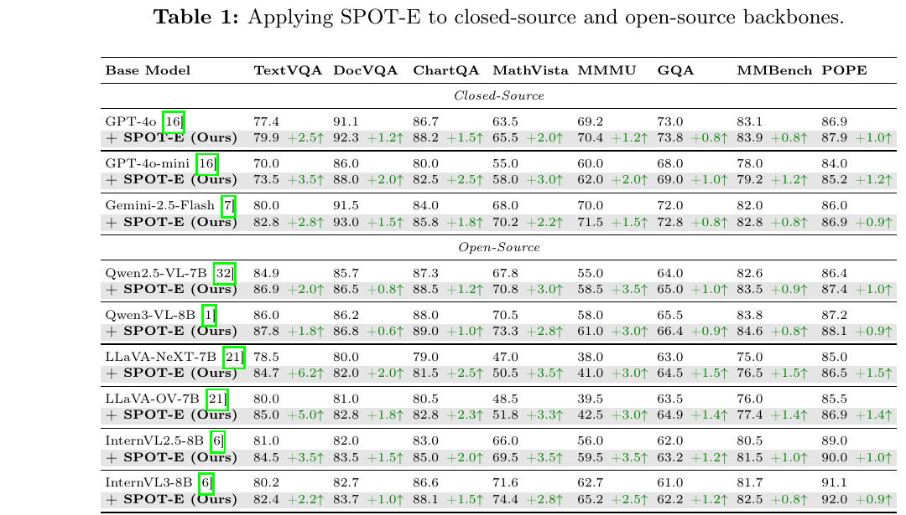
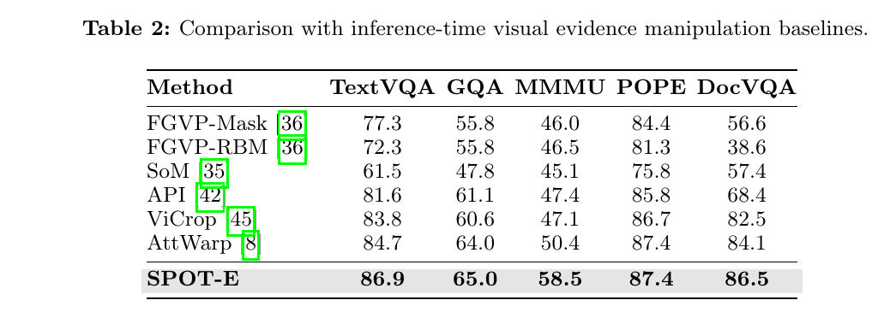

# SPOT-E

### Test-Time Entropy Shaping with Visual Spotlights for Frozen VLMs

Bo Yin, Xiaobin Hu, Chengming Xu, Ruolin Shen, Mo Yang, Jiangning Zhang, Peng-Tao Jiang, Cheng Tan, Shuicheng Yan

  
  

  Official repository for <strong>SPOT-E</strong>. Code will be released soon.

---

## Framework

  

  <em>SPOT-E freezes the VLM and optimizes a lightweight visual spotlight at test time.</em>

## Main Results

  <strong>Applying SPOT-E to closed-source and open-source backbones.</strong>

  

 

  <strong>Comparison with inference-time visual evidence manipulation baselines.</strong>

  

