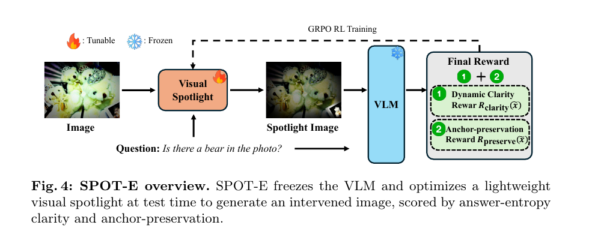

# SPOT-E: Test-Time Entropy Shaping with Visual Spotlights for Frozen VLMs
[](https://arxiv.org/abs/2606.20244)

SPOT-E is a plug-and-play test-time visual spotlight component for frozen VLMs.
This repo implements the method scaffold only: no VLM or CLIP model is loaded by default.

<div align="center">
  
</div>

## Install

```bash
pip install -e .
```

## Quick Example

Implement your VLM adapter in `examples/minimal_probe.py`.
The only method you need to replace is `YourVLMProbe.trace(...)`: it should return token-level entropies and the final-answer token span.

```python
from PIL import Image

from spot_e import SPOTEPlugin, TokenTrace


class YourVLMProbe:
    def trace(self, image: Image.Image, question: str, *, baseline_trace=None) -> TokenTrace:
        # Baseline call: generate "Final answer: ..." and collect token entropies.
        # Spotlight call: if baseline_trace is provided, score the same baseline
        # token prefix under the spotlight image to keep anchors aligned.
        return TokenTrace(
            tokens=["Final", "answer", ":", "red"],
            entropies=[0.05, 0.07, 0.02, 0.42],
            answer_span=(3, 4),
            text="Final answer: red",
        )


image = Image.open("example.png").convert("RGB")
plugin = SPOTEPlugin(YourVLMProbe(), seed=7)
result = plugin.run(image, "What color is the upper garment?")

result.image.save("spotlight.png")
print(result.selected_evaluation)
```

Run the template:

```bash
python examples/minimal_probe.py
```

## Use A CLIP Relevance Map

You can seed the default spotlight policy with a CLIP-style relevance grid.

```python
from spot_e import GridSpotlightPolicy, SPOTEPlugin

policy = GridSpotlightPolicy()
policy.set_relevance_map(clip_relevance_grid)

plugin = SPOTEPlugin(probe, policy=policy)
result = plugin.run(image, question)
```

For global/crop max fusion:

```python
from spot_e import CropRelevance, fuse_relevance_maps, relevance_to_mask

fused = fuse_relevance_maps(
    global_relevance,
    crops=[
        CropRelevance(crop_relevance, box=(0, 0, 7, 7)),
        CropRelevance(other_crop_relevance, box=(7, 0, 14, 7)),
    ],
)
mask = relevance_to_mask(fused, temperature=0.25)
```

## What Is Inside

- `SPOTEPlugin`: per-instance SPOT-E loop
- `FrozenVLMProbe`: model adapter interface
- `GridSpotlightPolicy`: lightweight replaceable spotlight policy
- entropy-shaping reward with answer entropy and low-entropy anchors
- spotlight image operator `x_tilde = m*x + (1-m)*B(x)`
- GRPO-style group-relative candidate scoring

## Citation

```bibtex
@article{yin2026spote,
  title={SPOT-E: Test-Time Entropy Shaping with Visual Spotlights for Frozen VLMs},
  author={Yin, Bo and Hu, Xiaobin and Xu, Chengming and Shen, Ruolin and Yang, Mo and Zhang, Jiangning and Jiang, Peng-Tao and Tan, Cheng and Yan, Shuicheng},
  journal={arXiv preprint arXiv:2606.20244},
  year={2026}
}
```
